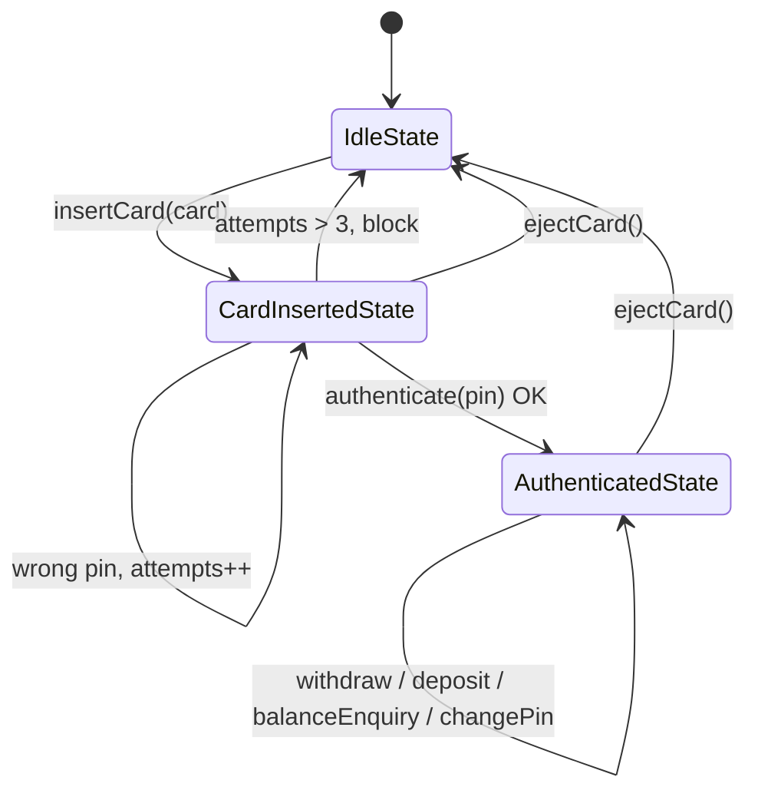
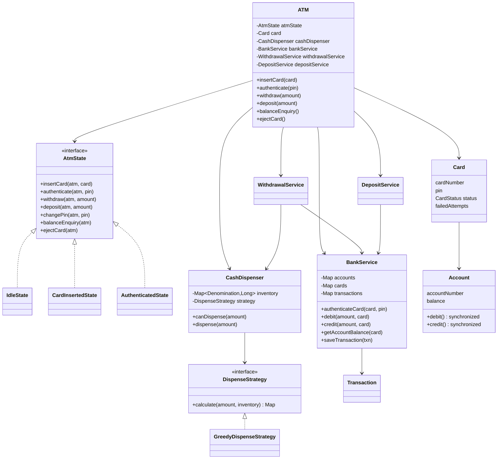
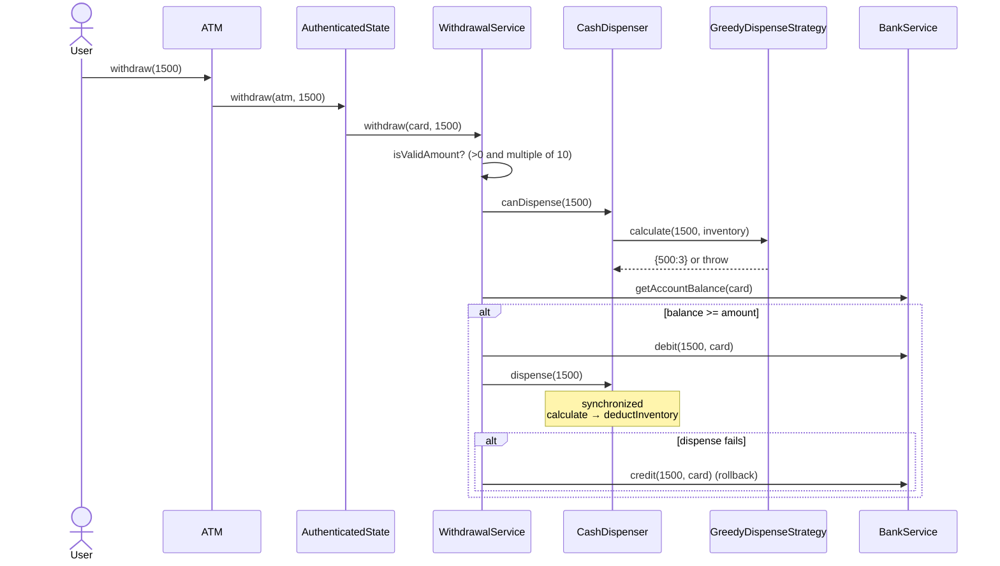
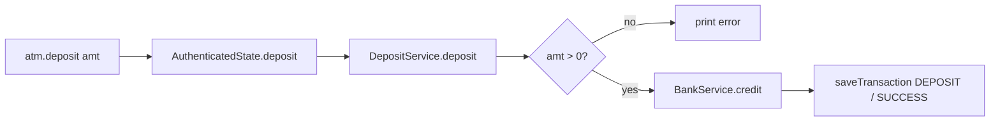

# ATM — LLD Flow Diagrams

**Patterns:** State (`AtmState`) · Strategy (`DispenseStrategy`) · Service layer (Bank / Withdrawal / Deposit)

## 1. State machine (the core of this design)

| Operation        | Idle | CardInserted | Authenticated |
|------------------|:----:|:------------:|:-------------:|
| insertCard       | ✅   | ❌           | ❌            |
| authenticate     | ❌   | ✅           | ❌ (already)  |
| withdraw/deposit | ❌   | ❌           | ✅            |
| ejectCard        | ❌   | ✅           | ✅            |

`ATM` holds the current `atmState` and passes every call to it: `atm.withdraw(x)` becomes `atmState.withdraw(this, x)`.

## 2. Class diagram

## 3. Withdraw flow (sequence)

**Greedy dispense idea:** go through denominations 500 → 200 → 100 → 50 → 20 → 10 and take `min(available, remaining / note)` of each note. If anything is left over at the end, throw.

## 4. Deposit flow

## 5. Revision points

- **Concurrency:** `Account.debit/credit` are `synchronized`, `CashDispenser.dispense` is `synchronized`, and `BankService` uses `ConcurrentHashMap` plus synchronized lists.
- **Compensation:** debit first, then dispense. If dispensing fails, credit the money back.
- **Card blocking:** after more than 3 failed PIN attempts, `blockCard` runs and the card is removed.

Gaps in the current code (worth fixing / mentioning in an interview)

- `authenticateCard` always returns `true`. It never compares the PIN.
- `Card.status` is never set to `ACTIVE`, so `validateCard` throws.
- `cardToAccountMap` is keyed by **account number** but looked up by **card number**.
- `GreedyDispenseStrategy` uses `remaining > value`. It should be `>=`.
- `deductInventory` has an inverted check: `available > needed` throws.
- `AuthenticatedState.changePin` is empty, and `balanceEnquiry` prints "not allowed".
- Withdrawals are never recorded as transactions (`recordTransaction` is never called).

