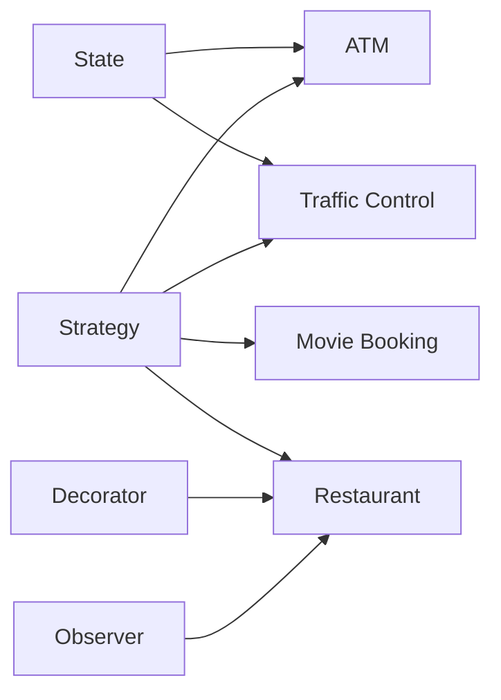

# LLD Projects — Revision Index

Every project has a `FLOW.md` with Mermaid diagrams that GitHub renders automatically.

| Project | Diagrams | Key patterns |
|---|---|---|
| ATM | [ATM/FLOW.md](ATM/FLOW.md) | State, Strategy (cash dispense) |
| Movie Booking | [moiveBookingSystem/FLOW.md](moiveBookingSystem/FLOW.md) | Strategy (pricing, payment), seat locking |
| Restaurant Management | [restaurantManagementSystem/FLOW.md](restaurantManagementSystem/FLOW.md) | Decorator, Observer, Strategy |
| Traffic Control *(WIP)* | [TrafficControlSystem/FLOW.md](TrafficControlSystem/FLOW.md) | State, Strategy |

## Patterns at a glance

## Common approach used across these projects

1. **Models** (entities + enums for status)
2. **Services** (business flow, one per use case)
3. **Strategy** for anything that can change (payment, pricing, dispensing)
4. **Concurrency:** lock at the smallest shared resource (a `Show`, a `Table`, an `Account`)
5. **ClientDemo** wires everything together and runs the happy path
