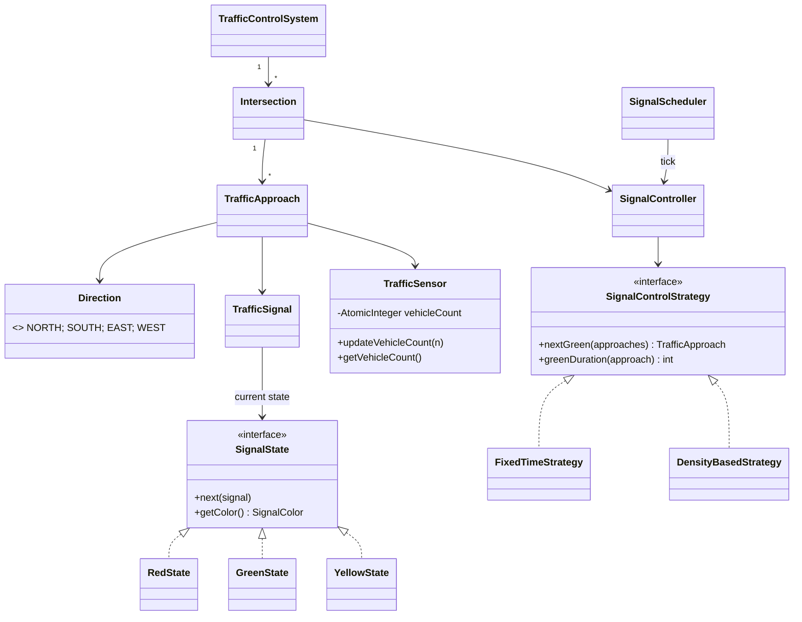
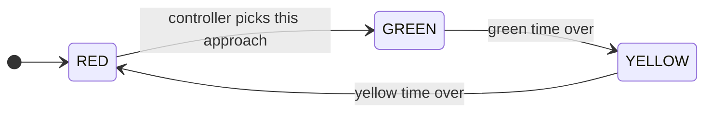
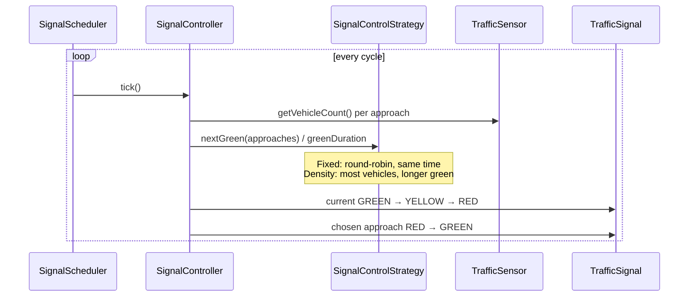

# Traffic Control System — LLD Flow Diagrams

> ⚠️ **Work in progress.** Only `TrafficSensor` has an implementation. The other classes are empty stubs. The diagrams below show the design the class and package names point to, so you can use them as a blueprint while you finish the code.

**Patterns (planned):** State (`RedState` / `GreenState` / `YellowState`) · Strategy (`FixedTimeStrategy` / `DensityBasedStrategy`)

## 1. Class diagram (planned)

## 2. Signal state machine

## 3. Control loop (planned)

## 4. Revision points

- **Safety rule:** an intersection has at most one conflicting approach on GREEN at a time. The controller turns the current signal RED before it sets the next one GREEN.
- **Strategy swap:** `FixedTimeStrategy` suits predictable traffic, and `DensityBasedStrategy` reads the sensor counts. You can change strategy at runtime.
- **Concurrency:** the sensor count uses `AtomicInteger` because sensors update from other threads. The scheduler can run on a `ScheduledExecutorService`.
