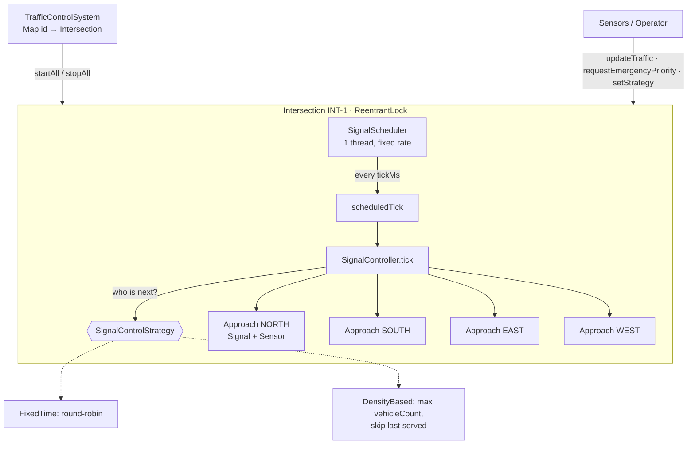
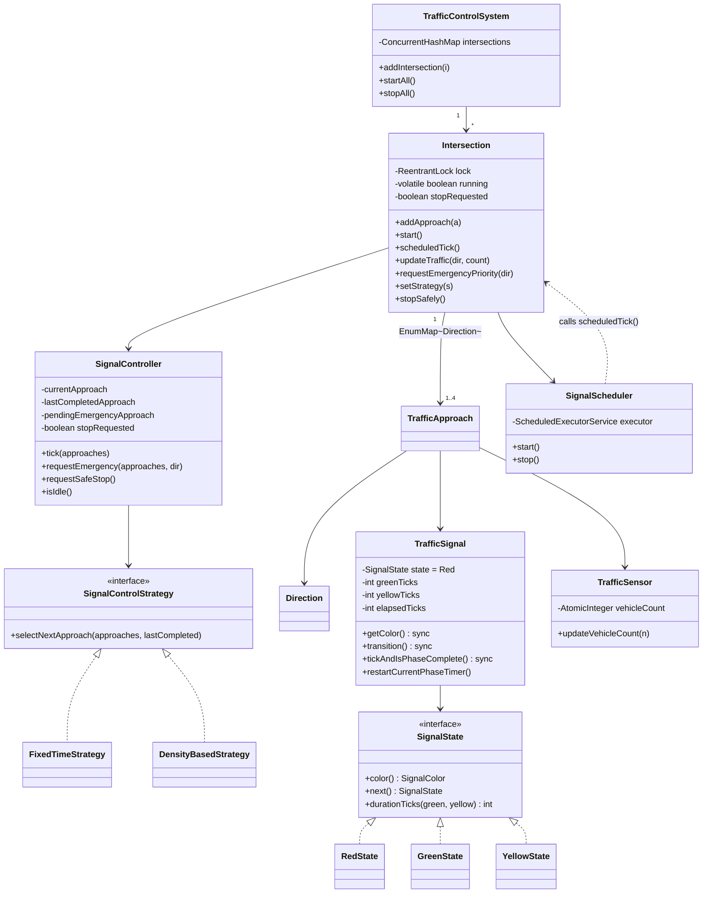
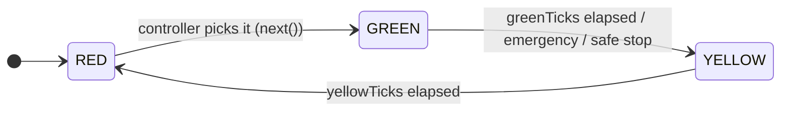
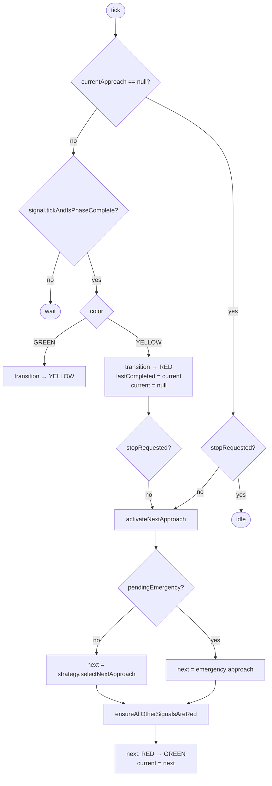
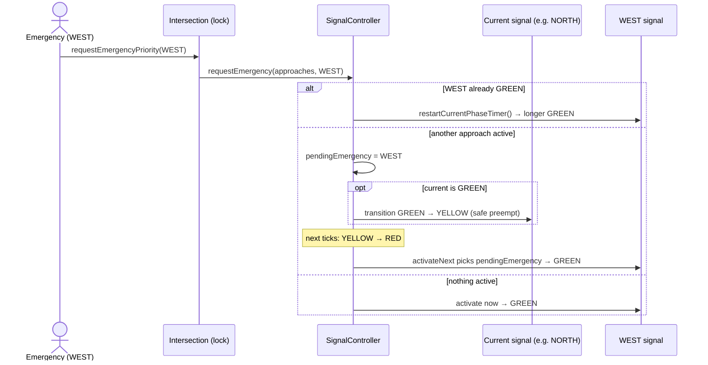
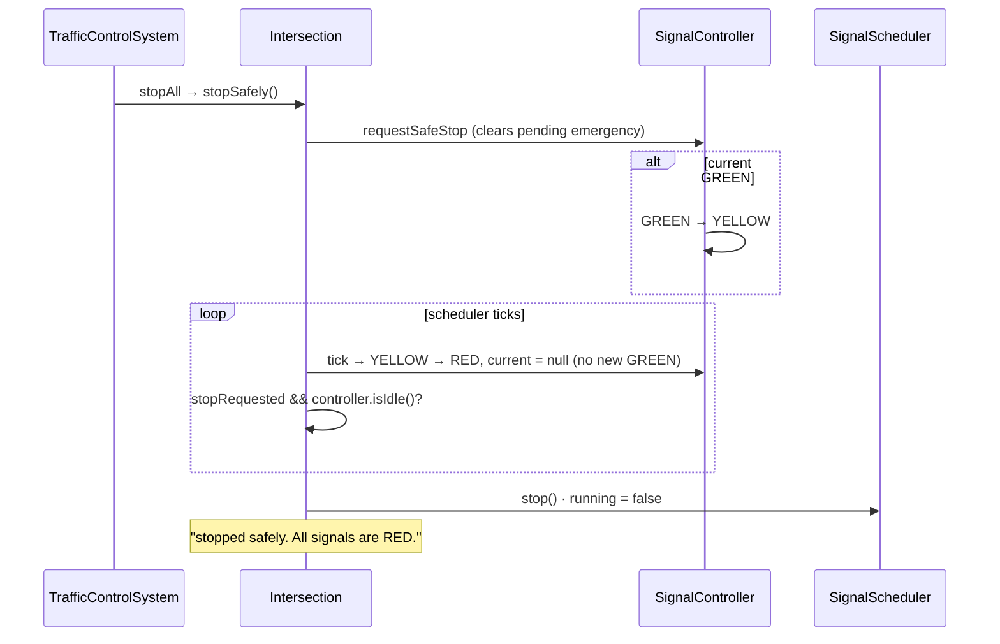
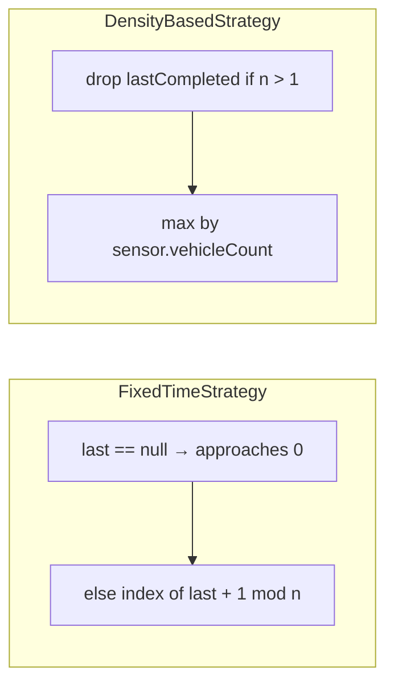

# Traffic Control System — LLD Flow Diagrams

**Patterns:** State (`RedState` / `GreenState` / `YellowState`) · Strategy (`FixedTimeStrategy` / `DensityBasedStrategy`) · Scheduler (`ScheduledExecutorService`, one per intersection)

**One-line summary:** each `Intersection` has a scheduler thread that calls `scheduledTick()` every N ms. The `SignalController` decides which approach turns GREEN (using the strategy), and each `TrafficSignal` counts its own ticks through the state pattern. Only one approach is ever non-RED.

## 1. Big picture

## 2. Class diagram

## 3. Signal state (State pattern)

| State  | `durationTicks` | `next()` |
|--------|-----------------|----------|
| RED    | 0: stays RED until the controller picks it | GREEN |
| GREEN  | greenTicks      | YELLOW |
| YELLOW | yellowTicks     | RED |

**Safety rule:** the code never goes GREEN → RED directly, and it never makes a signal GREEN while another one is not RED (`ensureAllOtherSignalsAreRed` throws if that would happen).

## 4. What happens on each tick (`SignalController.tick`)

### Example timeline from `Main` (tick = 1 s, green = 3 ticks, yellow = 1 tick, FixedTime)

```mermaid
gantt
    dateFormat s
    axisFormat %S
    section NORTH
    GREEN :n1, 0, 3s
    YELLOW :n2, after n1, 1s
    section SOUTH
    GREEN :s1, after n2, 3s
    YELLOW :s2, after s1, 1s
    section EAST
    GREEN :e1, after s2, 3s
```

Round-robin follows `EnumMap` order: **NORTH → SOUTH → EAST → WEST**.

## 5. Emergency preemption

## 6. Safe stop

## 7. Strategies

The strategy can be swapped at runtime with `intersection.setStrategy(...)`, under the lock. It takes effect the next time a signal is picked.

## 8. Revision points

- **Threading:**
  - **One scheduler thread per intersection:** each has its own single-thread executor (daemon), so intersections run independently.
  - **One lock per intersection:** a `ReentrantLock` guards everything the intersection does (tick, emergency, strategy, stop), so `SignalController` itself doesn't need to be thread-safe.
  - **Sensors don't take the lock:** they update through `AtomicInteger`.
  - **`running` is `volatile`:** so `isRunning()` can read it without taking the lock.
- **Ticks, not sleeps:** each signal counts `elapsedTicks` against its phase length, which keeps the design deterministic and easy to test.
- **The controller owns the choice of the next GREEN.** A RED signal never turns itself GREEN (its duration is 0).
- **Emergency is preemption, not a hard cut:** the current signal goes GREEN → YELLOW → RED, then the emergency approach goes GREEN.
- **Safe stop:** let the current cycle finish to all-RED, then shut down the executor.
- **Failures:** `scheduledTick` catches `RuntimeException`. Otherwise one exception would silently stop `scheduleAtFixedRate` forever.

Gaps in the current code

- `Main`'s "Safe stop requested" step calls `system.startAll()`. It should be `stopAll()`, so the demo never stops.
- The `TrafficSignal(redTicks, yellowTicks)` constructor: `redTicks` is actually used as the **green** duration (`GreenState.durationTicks` returns the first argument). Rename it to `greenTicks`.
- The density strategy only chooses **who** goes next. Green time stays fixed and doesn't grow with vehicle count.
- `SignalColor.YEllOW` has a typo. `TrafficApproach.vehicleCount` is unused (the sensor holds the count).
- `SignalScheduler.start()` is not `synchronized` but `stop()` is. That's safe today only because both are called under the intersection lock.
- `read.txt` TODOs: move timings into a timing object, and allow starting a single intersection from `TrafficControlSystem`.

