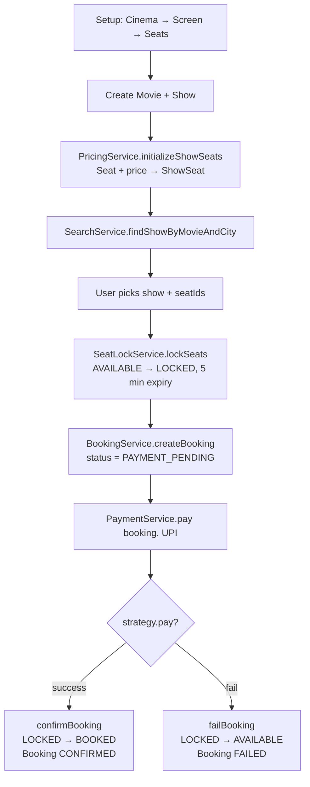
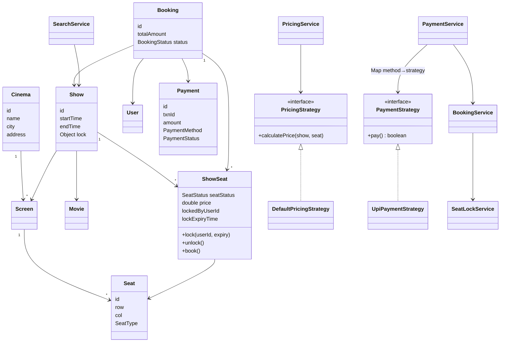
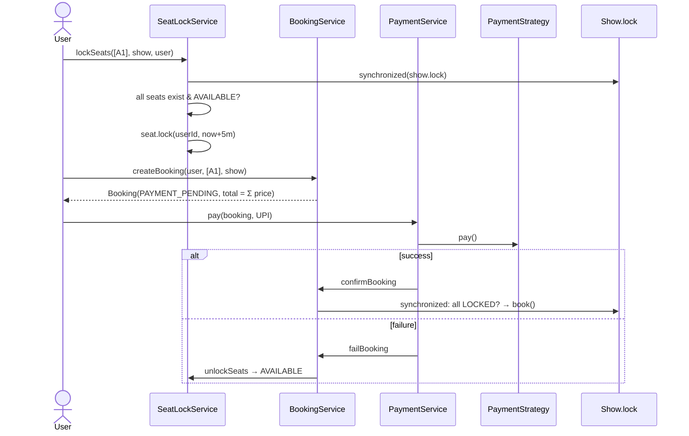
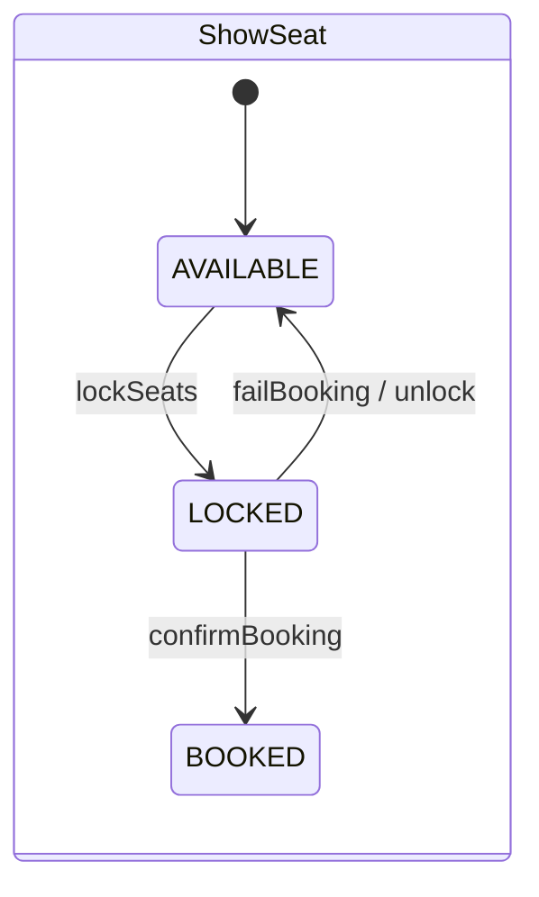
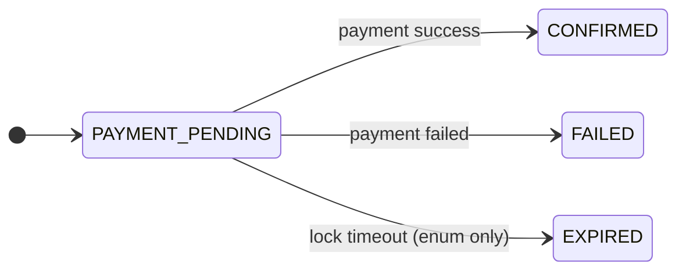

# Movie Booking System — LLD Flow Diagrams

**Patterns:** Strategy (`PricingStrategy`, `PaymentStrategy`) · Service layer · per-Show lock for concurrency

## 1. End-to-end flow

## 2. Class diagram

## 3. Booking + payment (sequence)

## 4. State machines

## 5. Revision points

- **Why `ShowSeat` and not `Seat`?** A `Seat` is physical and belongs to a screen. A `ShowSeat` is that seat for one particular show, and it holds the status and price.
- **Concurrency:** every change to seat status goes through `synchronized (show.getLock())`. The lock is per show, so different shows never block each other.
- **Two-phase booking:** LOCK (temporary hold with expiry), then PAY, then BOOK or UNLOCK.
- Pricing depends on `SeatType`: BASIC = 200, RECLINER = 350.

Gaps in the current code

- `lockExpiryTime` is stored but never checked. No expiry job exists, and nothing moves a booking to `EXPIRED`.
- `confirmBooking` doesn't check that `lockedByUserId` matches the booking's user.
- `Booking.payment` is never set.

