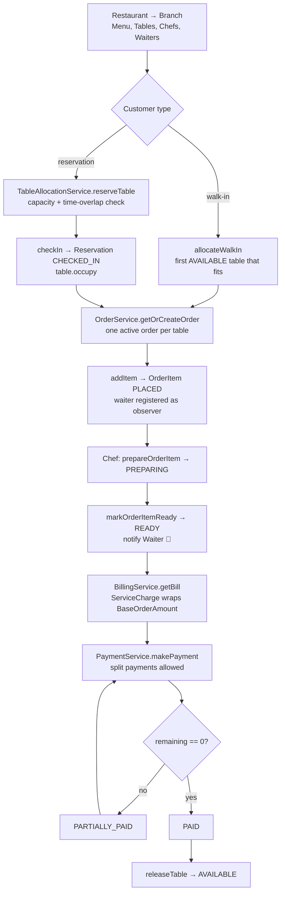
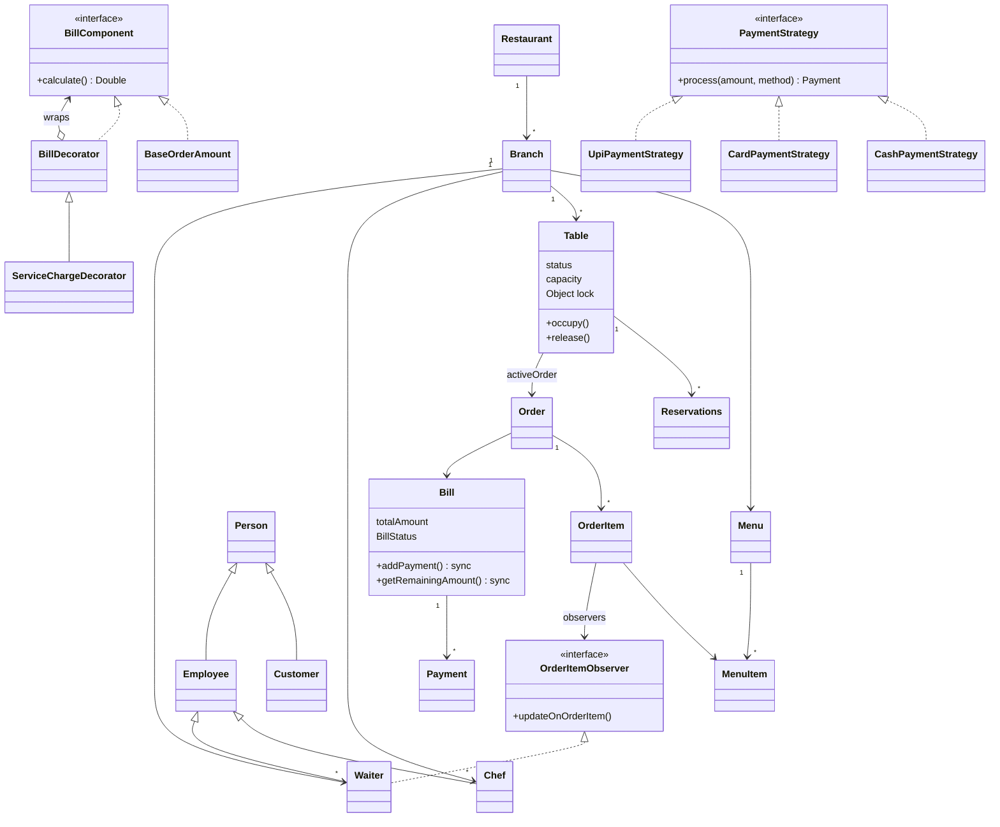
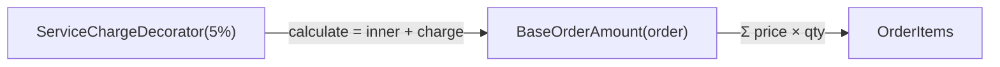
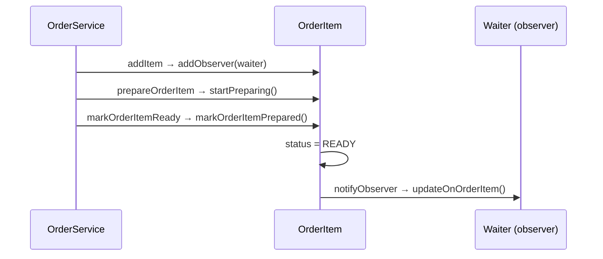
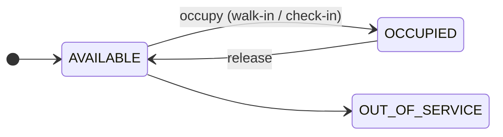
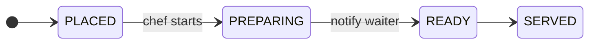
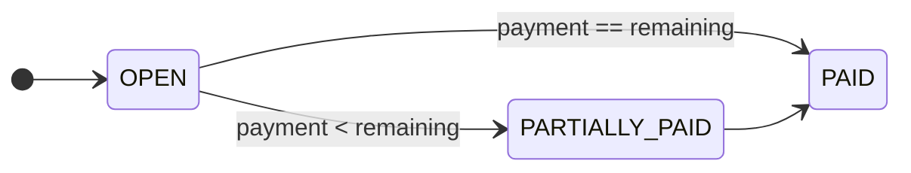

# Restaurant Management System — LLD Flow Diagrams

**Patterns:** Decorator (bill) · Observer (order item → waiter) · Strategy (payment) · per-Table lock

## 1. End-to-end flow

## 2. Class diagram

## 3. Decorator: how the bill is calculated

`new ServiceChargeDecorator(new BaseOrderAmount(order), 5.0)`. To stack more charges, keep wrapping: `new GstDecorator(new ServiceCharge(new Base(...)))`.

## 4. Observer: order item ready

## 5. State machines

## 6. Revision points

- **Concurrency:** each `Table` has its own `lock` object. Allocation, order creation, and billing all run inside `synchronized(table.getLock())`. `Bill.addPayment` is `synchronized`.
- **Split payments:** `makePayment` rejects any amount above `remaining`. The bill is `PAID` once `remaining == 0`.
- **Reservation overlap:** two bookings overlap when `newFrom < existingEnd && newTo > existingStart`.

Gaps in the current code

- `ServiceChargeDecorator` does `+ pct/100`. It should be `+ inner * pct/100`.
- `getBill` doesn't store the bill on the order, so the "return existing bill" check never hits.
- `reserveTable` reserves **every** eligible table instead of the first, and a new reservation's `status` is `null`.
- `Branch.addChef/addWaiter` are empty, and `Waiter.updateOnOrderItem` does nothing.

